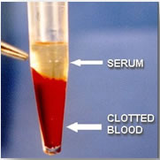
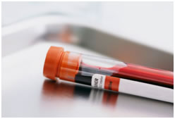

### Principle

Blood serum can be defined in a number of ways. Clear, watery fluid of the blood that separates when blood clots or  blood plasma from which the protein fibrinogen or clotting factors, has been removed.  Clotting factors are the proteins which causes the clotting of blood. when the blood is allowed to clot after its withdrawn from a vein, the clot slowly shrinks and a clear watery  fluid squeezed out from the clot is known  as serum.

### Why use Serum for Studies?
 

Serum includes antibodies, antigens, electrolytes, hormones and  any exogenous substances such as drugs and microorganisms and all proteins expect that used in blood clotting. Thus it has applications not only in the field of clinical diagnostics, but also in research. A very simple example could be their use in the different types of ELISA tests. They are therefore used  to detect the presence of a particular antibody, antigen, hormone, exogenous substances, etc.  It has been proposed in several papers that observing changes in the curve of the ultra-violet absorption spectra of blood serum and certain amino acids may give us valuable information about pathological conditions.

 

Blood serum and plasma are biofluids that are increasingly important in NMR-based metabolomics analysis. Metabolite analysis of fluids from the circulatory system provides a view of the metabolic state of an organism. Unlike urine analysis, which measures an organism's waste products, serum or plasma analysis measures homeostatic levels of metabolites throughout the organism.

 

Following the rise of "Omics" in advanced research,  Biomarkers for various pathologic conditions needs a lot of interest in researches. Introduction of Array techniques has enhanced the output in work. Other than elevated or lower protein levels, MicroRNA profiling from blood serum and plasma is emerging as a new class of blood-based biomarkers. Abnormal levels of hormones and various other indicators can also be detected from serum, and are being used in clinical diagnostic labs for routine tests. The presence of elevated levels of antibodies indicates that the body is not at homeostasis.

 

It is important  to study the parameters like pharmacokinetics (what the body does to the drug) and pharmacodynamics (what the drug does to the body) while conducting clinical trials. Also it is necessary to know; how the drug is metabolized, what the half-life of the drug is, and  after metabolism in what chemical from it persists in the body. All these studies are important because when new agent is being studied, literally data from its 'death to birth' needs to be collected (with scientific evidences).

 

Pharmacological studies are among the most difficult realms to conquer. Blood serum is used in these studies to obtain information regarding all the critical parameters mentioned above. For example: in order to learn about the rate at which a molecule is being metabolized or to learn about the half-life, typically; serum from the patient is collected at various time intervals. Then, an HPLC (high-pressure liquid chromatography) is conducted to isolate the drug from rest of the content.  Next, a TANDEM-Mass spectrometric analysis  is conducted to learn about the concentration or amount present in a fixed amount of sample.

  

The serum chemistry profile is one of the most important initial tests that are commonly performed. The functions of various organs and body systems can be assessed by using these measurements. Sometimes a specific diagnosis may be made on the basis of a blood chemistry profile alone. More often than not, however, the profile provides information on a variety of body organs and systems, giving the doctor an indication of where a problem might be located. The profile can be extremely helpful in determining which of the many other diagnostic tests might be beneficial. Tests are performed to check Glucose, Blood Urea Nitrogen (BUN), Calcium, Total Protein, Cholesterol, Creatine Phosphokinase (CPK), Alkaline Phosphatase (ALP), Alanine Aminotransferase (ALT), Aspartate Aminotransferase (AST), Chloride, Potassium, Sodium levels, etc.

 

 
### Serum Collection
 

 

Blood sampling-

Blood obtained from the patient should be handled extremely carefully. Normally, blood is collected from the Intravenous route. It is directly transferred to a sterile container that is stoppered and also has a label on it. It depends on the purpose of collection whether the blood has been Heparinised (anti-coagulant) or not. When serum is desired to be collected, it is not heparenised, since we want the clot to form and remove the clotting factors from the sample!

 

It is critical to take care when an individual is  dealing with blood since blood is a biohazardous material. The container must be stoppered to prevent spillage, contamination, etc. The container must be properly labeled, since samples from multiple patients might be dealt with and there is high chance of confusion while conducting the tests. A wrong diagnosis can have devastating effects!! The clinician looking at the result makes a wrong conclusion, thus making his diagnosis also wrong; at the end of the day putting the life of the patient 'on the line'.

 

 

### Agents Used for Serum Preservation
 

 

The simplest method is refrigeration. Even though this is acceptable when the application is in a clinical and diagnostic lab, this is not a fool proof method. Due to the activity of the various substances present, the sample can either become inactive, or improper functioning may not occur during reuse. Thus the result cannot be completely trusted or dependable, neither might it be reproducible! Thus  direct refrigeration method  is not acceptable in terms of research applications. The chances of generating false, unreproducible data are very high.

 

 

Thus purification processes, prior to storage are recommended. Filter sterilization is the most commonly used method. Filters of various pore sizes are available. There are chances for the filter getting clogged. The filter can be fitted onto a sterile collection container, onto this filter; the container into which the sample will be poured is attached. At the side of the filter there is an outlet to which a vacuum pump is attached. After transferring the sample into the top container, the lid is sealed and the vacuum pump is turned on. Gradually, filtered serum gets collected at the bottom container. This can either be directly stored in the refrigerator or other preservative methods can be carried out using it.

 

 

Merthiolate is an organomercury compound. It is used as a well  established antiseptic and antifungal agent. Also used as a  used as a preservative in vaccines, immunoglobulin preparations, skin test antigens, antivenins, ophthalmic and nasal products, etc. It is very toxic by inhalation, ingestion, and in contact with skin, with a danger of cumulative effects. For  aquatic organisms also, it is a very toxic agent  and may cause long-term adverse effects in aquatic environments. when merthiolate reaches the body,  it is metabolized  to thiosalicylate and  ethylmercury (C2H5Hg+). Thus, the chemical should be handled only in the fume hood and the user should always wear disposable gloves.

 

Glycerol stocks are prepared for transportation purposes.  This is because, glycerol acts as an inherit layer between the fluid and the atmosphere. It thus preserves the cells, and also  acts as a shock absorber,  preventing damage of cells due to physical stress.
